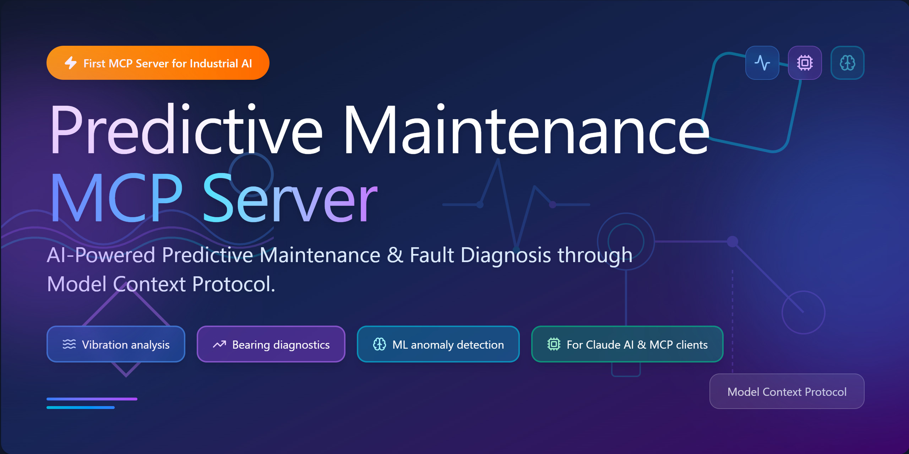
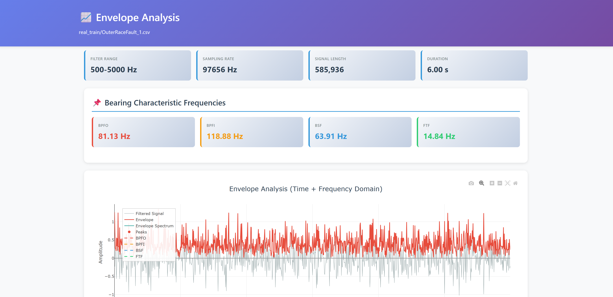
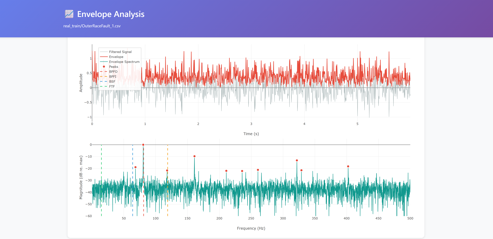
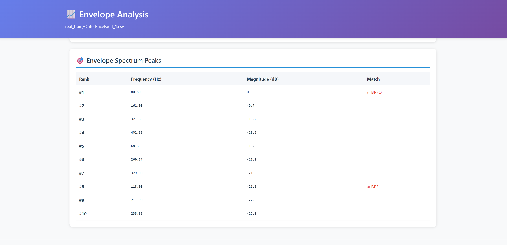
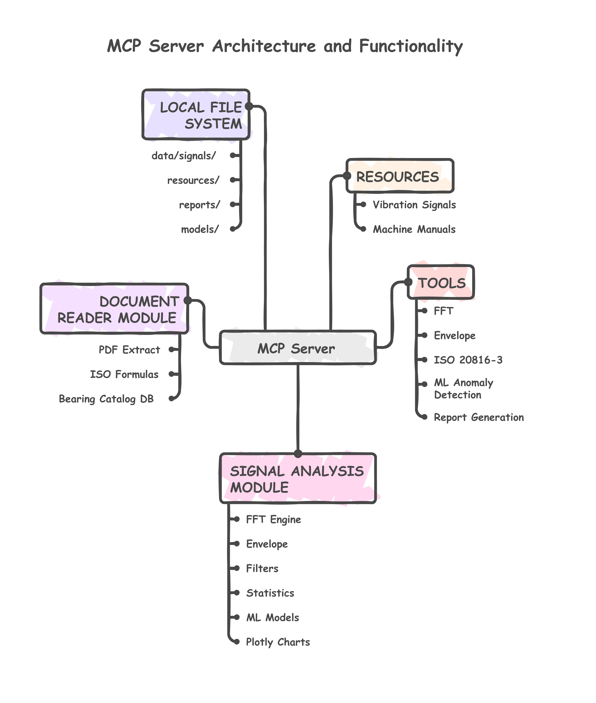

# GenAI-Powered-Predictive-Maintenance-System-with-MCP

[](https://www.python.org/downloads/)
[](https://doi.org/10.5281/zenodo.17611334)
[](https://github.com/LGDiMaggio/predictive-maintenance-mcp/actions/workflows/tests.yml)
[](https://codecov.io/gh/LGDiMaggio/predictive-maintenance-mcp)
[](https://github.com/jlowin/fastmcp)
[](https://opensource.org/licenses/MIT)
[](https://www.linkedin.com/in/luigi-gianpio-di-maggio)

A Model Context Protocol server that brings **industrial machinery diagnostics** directly to LLMs like Claude, enabling AI-powered vibration analysis, bearing fault detection, and predictive maintenance workflows all through natural conversation.

> 🔧 **From Vibration Data and Machine Manuals to Actionable Insights**: Transform raw sensor data into reports with ISO compliance checks, FFT analysis, envelope analysis and ML anomaly detection. PdM workflows supported by LLMs.



## 📑 Table of Contents

- [✨ What Makes This Special](#-what-makes-this-special)
- [🔬 Proof of Concept & Community Invitation](#-proof-of-concept--community-invitation)
- [🎬 Quick Examples](#-quick-examples)
- [🚀 Installation](#-installation)
- [Configuration](#configuration)
- [🔧 Available Tools & Resources](#-available-tools--resources)
- [Architecture](#architecture)
- [📊 Sample Dataset](#-sample-dataset)
- [💡 Usage Examples](#-usage-examples)
- [📊 Professional Reports](#-professional-reports)
- [Documentation](#documentation)
- [Debugging](#debugging)
- [🧪 Testing](#-testing)
- [🛠️ Development](#️-development)
- [🚀 Roadmap & Recent Updates](#-roadmap--recent-updates)
- [License](#license)
- [Citation](#citation)
- [Acknowledgments](#acknowledgments)
- [Support](#support)

## ✨ What Makes This Special

- **🎯 Real Bearing Fault Data Included** - 21 production-quality vibration signals from real machinery tests (3 healthy, 18 faulty)
- **📊 Professional HTML Reports** - Interactive Plotly visualizations with automatic peak detection and frequency markers
- **🤖 ML Anomaly Detection** - Train unsupervised/semi-supervised models (OneClassSVM/LOF) on healthy baselines with optional hyperparameter tuning
- **📏 ISO 20816-3 Compliance** - Industry-standard vibration severity assessment built-in

- **🔍 Advanced Diagnostics** - FFT spectrum analysis, envelope analysis for bearing faults, time-domain feature extraction
  <details>
  <summary><b>Example analysis</b></summary>
  
  
  
  
  
  </details>
- **🚀 Zero Configuration** - Works out of the box with sample data, auto-detects sampling rates from metadata

## 🔬 Proof of Concept & Community Invitation

**This is a Proof of Concept (PoC)** - a demonstration of feasibility showing how LLMs can be empowered with industrial diagnostics capabilities through the Model Context Protocol.

### PoC Goals Achieved ✅

- ✅ **Real vibration data integration** - 21 bearing fault signals with metadata (train: 14, test: 7)
- ✅ **Professional analysis workflows** - FFT spectrum, envelope analysis, ISO 20816-3 compliance
- ✅ **ML anomaly detection** - Semi-supervised learning with hyperparameter tuning
- ✅ **Metadata-driven auto-detection** - Sampling rates and signal units from JSON files
- ✅ **Interactive HTML reports** - Plotly visualizations with automatic peak detection
- ✅ **Natural language interface** - Complex diagnostics through conversational AI

### 🤝 We Invite the Community to Contribute!

This PoC demonstrates the potential. Now we need **your expertise** to make it production-ready.

**How You Can Help:**

- **📊 Add More Data** - Real-world vibration datasets from different machines/sensors/industries
- **🔧 Expand Diagnostics** - Gear fault detection, pump cavitation, motor electrical faults, misalignment
- **🤖 Improve ML** - Deep learning approaches, advanced anomaly models, real-time streaming analysis
- **🌍 Internationalization** - Multi-language support, regional standards workflows (VDI, GB)
- **📖 Documentation** - Tutorials, case studies, industrial validation, best practices
- **🐛 Testing** - Edge cases, validation with ground truth data, cross-validation studies

**Get Involved:**

- 🐛 **Report issues**: [GitHub Issues](https://github.com/LGDiMaggio/predictive-maintenance-mcp/issues)
- 💡 **Suggest features**: [Discussions](https://github.com/LGDiMaggio/predictive-maintenance-mcp/discussions)
- 🔀 **Submit PRs**: See [CONTRIBUTING.md](CONTRIBUTING.md)
- 💬 **Join the conversation**: [LinkedIn](https://www.linkedin.com/in/luigi-gianpio-di-maggio)

**Why This Matters:**

Predictive maintenance is critical for Industry 4.0. Complex diagnostic and maintenance workflows can be **integrated with LLMs to augment human engineering work** when proper context and tools are provided. Through the Model Context Protocol (MCP), we bridge LLM reasoning capabilities with specialized diagnostic tools, enabling **democratized access to expert-level machinery diagnostics** and making industrial AI more accessible to engineers worldwide.

## 🎬 Quick Examples

### Example 1: Bearing Fault Detection

```
Generate envelope report for real_train/OuterRaceFault_1.csv
```

**Result**: AI automatically:
1. Detects sampling rate from metadata (97,656 Hz)
2. Applies bandpass filter (500-5000 Hz)
3. Generates interactive HTML report with bearing fault frequencies marked
4. Identifies outer race fault at ~81 Hz with harmonics
5. Saves report to `reports/envelope_OuterRaceFault_1_*.html`

### Example 2: ISO 20816-3 Vibration Assessment

```
Evaluate real_train/OuterRaceFault_1.csv against ISO 20816-3 standard
```

**Result**: 
- RMS velocity: 4.5 mm/s → Zone B (Acceptable for long-term operation)
- Interactive HTML report with zone visualization
- Compliance assessment and recommendations

### Example 3: Machine Manual Integration + Diagnosis

```
1. Extract specifications from test_pump_manual.pdf
2. Calculate bearing frequencies for SKF 6205-2RS at 1475 RPM
3. Diagnose bearing fault in signal_from_pump.csv using calculated frequencies
```

**Result**: Complete zero-knowledge diagnosis:
- Extracts: Drive end bearing SKF 6205-2RS, operating speed 1475 RPM
- Calculates: BPFO=85.20 Hz, BPFI=136.05 Hz, BSF=101.32 Hz
- Diagnoses: Outer race fault detected with 3 harmonics

📚 **More examples**: See [Usage Examples](#-usage-examples) section below or [EXAMPLES.md](EXAMPLES.md) for complete workflows

## Available Tools & Resources

### MCP Resources (Direct Data Access)

Resources provide **direct read access** for Claude to examine data:

<details>
<summary><b>📊 Vibration Signals</b></summary>

- **`signal://list`** - Browse all available signal files with metadata
- **`signal://read/{filename}`** - Read signal data directly (first 1000 samples preview)

**Usage:** Claude can directly read signals without calling tools first.

</details>

<details>
<summary><b>📖 Machine Manuals</b></summary>

- **`manual://list`** - Browse available equipment manuals (PDF/TXT)
- **`manual://read/{filename}`** - Read manual text (first 20 pages)

**Usage:** Claude can answer ANY question about manual content by reading directly.

</details>

---

### MCP Tools (Analysis & Processing)

Tools perform **computations and generate outputs**:

<details>
<summary><b>📊 Analysis & Diagnostics</b></summary>

- **`analyze_fft`** - FFT spectrum analysis with automatic peak detection
- **`analyze_envelope`** - Envelope analysis for bearing fault detection
- **`analyze_statistics`** - Time-domain statistical indicators (RMS, Crest Factor, Kurtosis, etc.)
- **`evaluate_iso_20816`** - ISO 20816-3 vibration severity assessment
- **`diagnose_bearing`** - Guided 6-step bearing diagnostic workflow
- **`diagnose_gear`** - Evidence-based gear fault diagnostic workflow

</details>

<details>
<summary><b>🤖 Machine Learning</b></summary>

- **`extract_features_from_signal`** - Extract 17+ statistical features from vibration data
- **`train_anomaly_model`** - Train novelty detection models (OneClassSVM/LOF) on healthy data only, with optional semi-supervised hyperparameter tuning
- **`predict_anomalies`** - Detect anomalies in new signals with confidence scores

</details>

<details>
<summary><b>📄 Professional Report Generation</b></summary>

- **`generate_fft_report`** - Interactive FFT spectrum HTML report with peak table
- **`generate_envelope_report`** - Envelope analysis report with bearing fault markers
- **`generate_iso_report`** - ISO 20816-3 evaluation with zone visualization
- **`list_html_reports`** - List all generated reports with metadata
- **`get_report_info`** - Get report details without loading full HTML

> 💡 **All reports are interactive Plotly visualizations saved to `reports/` directory**

</details>

<details>
<summary><b>📖 Machine Documentation Reader</b></summary>

- **`list_machine_manuals`** - List available equipment manuals (PDF/TXT)
- **`extract_manual_specs`** - Extract bearings, RPM, power from manual (with caching)
- **`calculate_bearing_characteristic_frequencies`** - Calculate BPFO/BPFI/BSF/FTF from geometry
- **`read_manual_excerpt`** - Read manual text excerpt (configurable page limit)
- **`search_bearing_catalog`** - Search bearing geometry in local catalog (20+ common bearings)

**MCP Resources:**
- `manual://list` - Browse available manuals
- `manual://read/{filename}` - Read manual for LLM context

> 🎯 **Upload pump manual → Extract bearing specs → Auto-calculate frequencies → Diagnose signal**

</details>

<details>
<summary><b>🔍 Data Management</b></summary>

- **`list_signals`** - Browse available signal files with metadata
- **`generate_test_signal`** - Create synthetic signals for testing

</details>

## Architecture

The system follows a **hybrid MCP architecture** combining Resources (direct data access) and Tools (computational processing):



<details>
<summary><b>Detailed Structure</b></summary>

```
┌─────────────────────────────────────────────────────────────┐
│                    CLAUDE / LLM CLIENT                      │
└────────────────────┬────────────────────────────────────────┘
                     │
                     ▼
┌─────────────────────────────────────────────────────────────┐
│                   MCP SERVER (FastMCP)                      │
│  ┌──────────────────────────────────────────────────────┐  │
│  │  RESOURCES (Direct Data Access)                      │  │
│  │  ┌────────────────────────────────────────────────┐  │  │
│  │  │  Vibration Signals                             │  │  │
│  │  │  • signal://list                               │  │  │
│  │  │  • signal://read/{filename}                    │  │  │
│  │  └────────────────────────────────────────────────┘  │  │
│  │  ┌────────────────────────────────────────────────┐  │  │
│  │  │  Machine Manuals                               │  │  │
│  │  │  • manual://list                               │  │  │
│  │  │  • manual://read/{filename}                    │  │  │
│  │  └────────────────────────────────────────────────┘  │  │
│  └──────────────────────────────────────────────────────┘  │
│  ┌──────────────────────────────────────────────────────┐  │
│  │  TOOLS (Analysis & Processing)                       │  │
│  │  • FFT, Envelope, ISO 20816-3                        │  │
│  │  • ML Anomaly Detection                              │  │
│  │  • Report Generation (HTML)                          │  │
│  │  • Manual Spec Extraction                            │  │
│  │  • Bearing Frequency Calculation                     │  │
│  │  • Bearing Catalog Search                            │  │
│  └──────────────────────────────────────────────────────┘  │
└────────────────────┬────────────────────────────────────────┘
                     │
        ┌────────────┴────────────┐
        ▼                         ▼
┌──────────────────┐   ┌──────────────────────────────────┐
│  SIGNAL ANALYSIS │   │  DOCUMENT READER MODULE          │
│  MODULE          │   │  ┌────────────┐  ┌────────────┐  │
│  • FFT Engine    │   │  │ PDF Extract│  │ ISO Formulas│  │
│  • Envelope      │   │  │ (PyPDF2)   │  │ BPFO/BPFI   │  │
│  • Filters       │   │  └────────────┘  └────────────┘  │
│  • Statistics    │   │  ┌─────────────────────────────┐  │
│  • ML Models     │   │  │  Bearing Catalog DB         │  │
│  • Plotly Charts │   │  │  • 20+ ISO bearings         │  │
│                  │   │  └─────────────────────────────┘  │
└────────┬─────────┘   └────────┬─────────────────────────┘
         │                      │
         ▼                      ▼
┌─────────────────────────────────────────────────────────────┐
│                   LOCAL FILE SYSTEM                         │
│  ┌──────────────────────┐   ┌──────────────────────────┐   │
│  │  data/signals/       │   │  resources/              │   │
│  │  ├── real_train/     │   │  ├── machine_manuals/    │   │
│  │  ├── real_test/      │   │  ├── bearing_catalogs/   │   │
│  │  └── samples/        │   │  ├── datasheets/         │   │
│  └──────────────────────┘   │  └── cache/ (auto)       │   │
│  ┌──────────────────────┐   └──────────────────────────┘   │
│  │  reports/            │   ┌──────────────────────────┐   │
│  │  • FFT reports       │   │  models/                 │   │
│  │  • Envelope reports  │   │  • Trained ML models     │   │
│  │  • ISO reports       │   │  • Scalers, PCA          │   │
│  └──────────────────────┘   └──────────────────────────┘   │
└─────────────────────────────────────────────────────────────┘
```

</details>

**Key Features:**
- ✅ **4 MCP Resources** - Direct read access to signals and manuals
- ✅ **25+ MCP Tools** - Complete diagnostic workflow
- ✅ **Hybrid Architecture** - Resources for reading, Tools for processing
- ✅ **Local-First** - All data stays on your machine (privacy-preserving)

##  Installation

### Quick Start (Python Package)

```bash
# 1. Clone repository
git clone https://github.com/LGDiMaggio/predictive-maintenance-mcp.git
cd predictive-maintenance-mcp

# 2. Run automated setup
python setup_venv.py

# 3. Activate environment
.venv\Scripts\activate  # Windows
source .venv/bin/activate  # Linux/macOS

# 4. Verify installation
python validate_server.py
```

📖 **Detailed Installation Guide**: See [INSTALL.md](INSTALL.md) for troubleshooting, Claude Desktop setup, and developer instructions.

### From Source (Advanced)

```bash
git clone https://github.com/LGDiMaggio/predictive-maintenance-mcp.git
cd predictive-maintenance-mcp
pip install -e .
```

## Configuration

### Claude Desktop

Add to your Claude Desktop config:
- **Windows**: `%APPDATA%\Claude\claude_desktop_config.json`
- **macOS**: `~/Library/Application Support/Claude/claude_desktop_config.json`

> 📋 **Example config**: See [`claude_desktop_config_PYTHON_VENV.json`](claude_desktop_config_PYTHON_VENV.json) for a complete example

```json
{
  "mcpServers": {
    "predictive-maintenance": {
      "command": "C:/path/to/predictive-maintenance-mcp/.venv/Scripts/python.exe",
      "args": ["C:/path/to/predictive-maintenance-mcp/src/machinery_diagnostics_server.py"]
    }
  }
}
```

> **Important Notes**:
> - Replace `C:/path/to/predictive-maintenance-mcp` with your actual project path
> - Use **absolute paths** for both `command` and `args`
> - On macOS/Linux, use `.venv/bin/python` instead of `.venv/Scripts/python.exe`
> - Forward slashes (`/`) work on all platforms, including Windows

After configuration, **restart Claude Desktop** completely.

### VS Code

Add to your MCP configuration (`.vscode/mcp.json` or user settings):

```json
{
  "servers": {
    "predictive-maintenance": {
      "command": "/path/to/predictive-maintenance-mcp/.venv/bin/python",
      "args": ["/path/to/predictive-maintenance-mcp/src/machinery_diagnostics_server.py"]
    }
  }
}
```

> Adjust paths according to your system (use `.venv/Scripts/python.exe` on Windows)

##  Sample Dataset

The server includes **21 real bearing vibration signals** from production machinery:

**Training Set (14 signals)**:
- ✅ **2 Healthy Baselines** - Normal operation data
- 🔴 **5 Inner Race Faults** - Variable load conditions
- ⚠️ **7 Outer Race Faults** - Various severity levels

**Test Set (7 signals)**:
- ✅ **1 Healthy Baseline** - Validation data
- 🔴 **2 Inner Race Faults** - Test conditions
- ⚠️ **3 Outer Race Faults** - Test conditions

> **Note**: Sampling rates and durations vary by signal (48.8-97.7 kHz, 3-6 seconds). All parameters auto-detected from metadata files.

📖 **Full dataset documentation**: [data/README.md](data/README.md)

## 💡 Usage Examples

### Quick Fault Detection

```
Diagnose bearing fault in real_train/OuterRaceFault_1.csv
BPFO=81.13 Hz, BPFI=118.88 Hz, BSF=63.91 Hz, FTF=14.84 Hz
```

**Result:** ✅ Outer race fault detected at ~81 Hz with harmonics

### Generate Professional Report

```
Generate envelope report for real_train/OuterRaceFault_1.csv
```

**Result:** Interactive HTML saved to `reports/` with bearing fault markers

### Train ML Anomaly Detector

```
Train anomaly model on baseline_1.csv and baseline_2.csv
Validate on OuterRaceFault_1.csv
```

**Result:** Model detects fault with 95%+ confidence

📚 **More examples**: [EXAMPLES.md](EXAMPLES.md) for complete diagnostic workflows

## 📊 Professional Reports

All analysis tools generate **interactive HTML reports** with Plotly visualizations:

### Why HTML Reports?

✅ **Universal** - Works with any LLM (Claude, ChatGPT, local models)  
✅ **Zero tokens** - Files saved locally, not in chat  
✅ **Interactive** - Pan, zoom, hover for details  
✅ **Professional** - Publication-ready visualizations  
✅ **Persistent** - Save for documentation and sharing

### Report Types

| Report | Tool | Contents |
|--------|------|----------|
| 🔊 **FFT Spectrum** | `generate_fft_report()` | Frequency analysis, peak detection, harmonic markers |
| 🎯 **Envelope Analysis** | `generate_envelope_report()` | Bearing fault frequencies, modulation detection |
| 📏 **ISO 20816-3** | `generate_iso_report()` | Vibration severity zones, compliance assessment |

All reports include:
- Interactive Plotly charts (pan/zoom/hover)
- Automatic peak detection with frequency tables
- Metadata (signal info, analysis parameters)
- Timestamp and file references

**Usage:**
```
Generate FFT report for baseline_1.csv
```
→ Opens `reports/fft_spectrum_baseline_1_20251111_143022.html` in browser

## Documentation

- [EXAMPLES.md](EXAMPLES.md) - Complete diagnostic workflows with step-by-step tutorials
- [CONTRIBUTING.md](CONTRIBUTING.md) - Contribution guidelines
- [CHANGELOG.md](CHANGELOG.md) - Version history

## Debugging

Use MCP Inspector for interactive testing:

```bash
npx @modelcontextprotocol/inspector npx predictive-maintenance-mcp
```

Or from source:

```bash
uv run mcp dev src/machinery_diagnostics_server.py
```

## 🧪 Testing

This project includes a comprehensive test suite covering all analysis tools:

```bash
# Run all tests
pytest

# Run with coverage report
pytest --cov=src --cov-report=html

# Run specific test file
pytest tests/test_fft_analysis.py

# Run with verbose output
pytest -v
```

**Test coverage includes:**
- ✅ FFT analysis and peak detection
- ✅ Envelope analysis and bearing fault detection
- ✅ ISO 20816-3 evaluation and zone classification
- ✅ ML tools (feature extraction, training, prediction)
- ✅ Report generation system (HTML outputs)
- ✅ Real bearing fault data validation

See [tests/README.md](tests/README.md) for detailed testing documentation.

## 🛠️ Development

### Install Development Dependencies

```bash
pip install -e ".[dev]"
```

### Code Quality

```bash
# Format code
black src/

# Type checking
mypy src/

# Linting
flake8 src/
```

## 🚀 Roadmap & Recent Updates

### ✨ New in v0.2.1: Machine Documentation Reader (Beta)

**AI-powered extraction of machine specifications from equipment manuals** 🎉

The system now includes a hybrid documentation reader that combines:
- 📄 **Direct PDF Access** - MCP Resources for full manual text reading
- 🔍 **Smart Extraction** - Regex patterns for bearings, RPM, power ratings
- 🧮 **Auto-Calculation** - Bearing fault frequencies from geometry (ISO 15243:2017)
- 💾 **Caching System** - Fast repeated queries with JSON caching

**What it can do:**
```
"What bearings are used in this pump?"
→ Extracts: Drive end: SKF 6205-2RS, Non-drive end: NSK 6206

"Calculate bearing fault frequencies at 1475 RPM"
→ BPFO: 85.20 Hz, BPFI: 136.05 Hz, BSF: 101.32 Hz, FTF: 9.47 Hz

"What type of mechanical seal is used?"
→ Type 21, carbon/ceramic faces (extracted from manual text)
```

**Status:** ✅ Core functionality working, comprehensive tests passing
